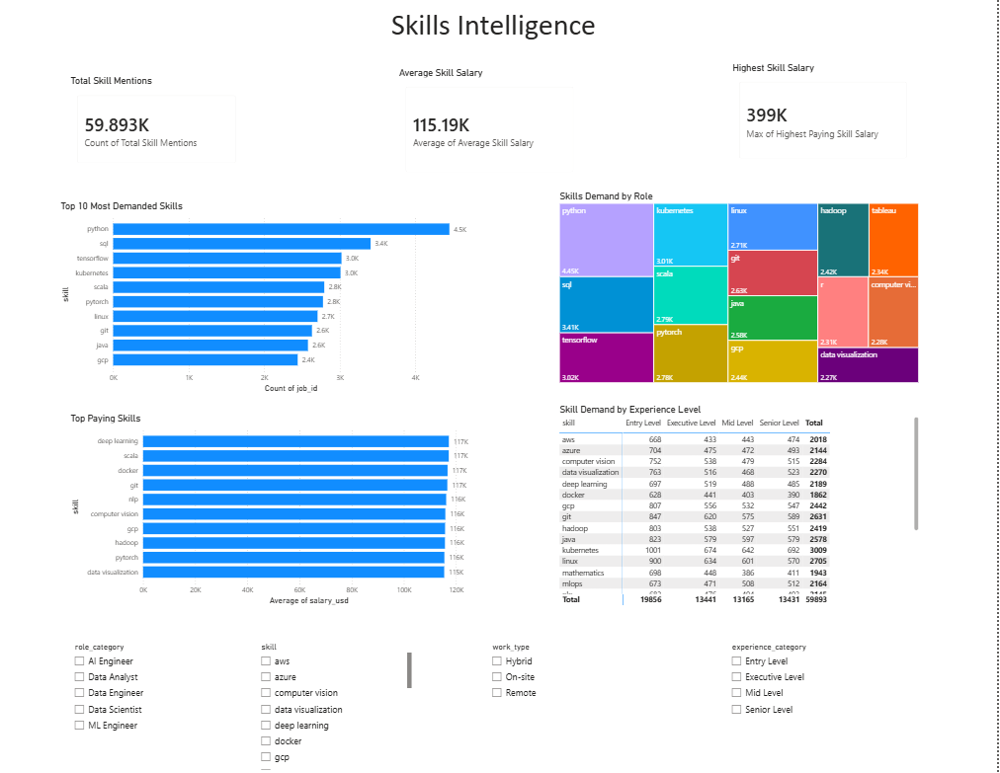
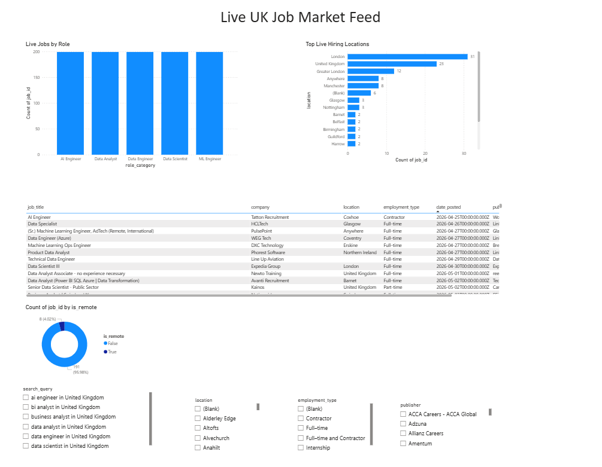

# UK Job Market Intelligence Platform

An end-to-end job market analytics platform built using Python, PostgreSQL, SQL, and Power BI to analyse UK hiring trends, salary patterns, skills demand, and remote work opportunities — powered by live job data from the JSearch API.

## Overview

Job seekers and analysts often struggle to understand:

- Which skills are most in demand
- Which locations have the highest hiring activity
- Current salary trends across roles and experience levels
- Remote vs hybrid vs on-site opportunities

This project automates the answer to all of these questions — pulling live job postings, cleaning and enriching them, storing them in a relational database, and presenting the findings through an interactive Power BI dashboard.

## Tools & Technologies

- **Python** — data collection, cleaning, feature engineering
- **Pandas / NumPy** — data manipulation
- **JSearch API** (via RapidAPI) — live UK job posting data
- **PostgreSQL** — relational database for storing cleaned data
- **SQLAlchemy** — Python-to-PostgreSQL connection
- **SQL** — analysis queries
- **Power BI** — interactive dashboard

## Project Workflow

```
JSearch API → Data Collection → Data Cleaning → Feature Engineering
            → PostgreSQL Database → SQL Analysis → Power BI Dashboard
```

## Project Structure

```
uk-job-market-intelligence-platform/
├── 01_data_collection.ipynb         # Calls JSearch API, collects raw job postings
├── 02_data_cleaning.ipynb           # Removes duplicates, fixes nulls, standardises formats
├── 03_feature_engineering.ipynb     # Builds salary_usd, experience_category, work_type, etc.
├── 04_sql_export.ipynb              # Loads cleaned data into PostgreSQL "jobs" table
├── 05_skills_table_creation.ipynb   # Extracts skill mentions into "job_skills" table
├── 06_live_jobs_sql_export.ipynb    # Loads live feed into "live_jobs" table
├── collect_live_jobs.py             # Standalone script — run on demand for fresh postings
├── schema.sql                       # Database table definitions (for manual setup/reference)
├── analysis_queries.sql             # 13 core SQL queries used in the analysis
├── requirements.txt                 # Python dependencies
├── .env.example                     # Template for required environment variables
├── Jobs analysis.pbix               # Power BI dashboard file
├── data/                            # Local data folders (raw/clean/engineered/scraped)
└── screenshots/                     # Dashboard screenshots
```

## Setup Instructions

### 1. Clone the repository
```bash
git clone https://github.com/<your-username>/uk-job-market-intelligence-platform.git
cd uk-job-market-intelligence-platform
```

### 2. Install dependencies
```bash
pip install -r requirements.txt
```

### 3. Set up your environment variables
Copy `.env.example` to `.env` and fill in your real RapidAPI key and PostgreSQL credentials:
```bash
cp .env.example .env
```

### 4. Create the PostgreSQL database
```sql
CREATE DATABASE uk_jobs_db;
```
Then optionally run `schema.sql` to pre-create the tables (the notebooks will also create them automatically).

### 5. Run the notebooks in order
1. `01_data_collection.ipynb`
2. `02_data_cleaning.ipynb`
3. `03_feature_engineering.ipynb`
4. `04_sql_export.ipynb`
5. `05_skills_table_creation.ipynb`

### 6. Refresh the live job feed (optional, repeatable)
```bash
python collect_live_jobs.py
```
Then run `06_live_jobs_sql_export.ipynb`.

### 7. Open the dashboard
Open `Jobs analysis.pbix` in Power BI Desktop and click **Refresh** to connect to your PostgreSQL database.

## Dashboard Pages

### 1. Executive Overview
Total jobs, average salary, average experience, average benefits score, jobs by role and work type, top hiring locations, and salary by experience level.

### 2. Skills Intelligence
Top 20 most demanded skills, skill demand by role category, skill demand by experience level, and the highest-paying skills.

### 3. Skills & Salary Intelligence
Average salary by role, average skill count by role, average salary by work type, and average salary by company size.

### 4. Live Job Market Feed
Current live job postings pulled on demand from the JSearch API — job-level detail table, top live hiring locations, and a remote vs non-remote breakdown.

## Methodology Notes

- **Salary normalisation:** all salaries (hourly, daily, monthly, annual) are converted to a single annual figure and then to USD using a fixed exchange rate, so different pay structures can be compared fairly.
- **`company_size_clean`:** the JSearch API does not return a structured employee-count field, so company size is estimated using a keyword heuristic on the job description text (e.g. "multinational", "startup", "small team"). A natural improvement would be an NLP-based classifier.
- **`benefits_score`:** scored 0–10 based on how many common benefit-related keywords (pension, health insurance, bonus, equity, flexible hours, etc.) appear in the job description.
- **Live feed refresh:** refreshing the Live Job Market Feed is currently a manual 3-step process — run `collect_live_jobs.py`, run `06_live_jobs_sql_export.ipynb`, then refresh Power BI. A natural next step is automating steps 1–2 with a scheduled job (cron / Task Scheduler) and using Power BI's scheduled refresh for step 3.

## Key Skills Demonstrated

Data Analysis, SQL, PostgreSQL, Power BI, ETL Pipelines, Dashboard Development, Business Intelligence, API Integration, Data Visualisation, Reporting, Python (Pandas, SQLAlchemy).

## Possible Future Improvements

- Automate the live data refresh with a scheduled job
- Replace keyword-based skill/benefit/company-size extraction with NLP (e.g. spaCy NER)
- Add a salary prediction model (scikit-learn) based on role, location, and required skills
- Containerise the pipeline with Docker for portability

## Dashboard Screenshots

### Executive Overview


### Skills Intelligence


### Skills & Salary Intelligence


### Live Job Market Feed


## Author

Mohammed Kaif

## License

This project is shared for educational and portfolio purposes. See `LICENSE` for details.
